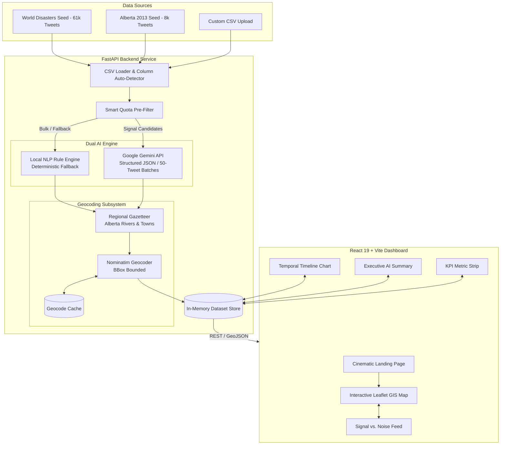

# ACHELOUS 🌊 — Flood Intelligence From The Ground Up

> **Thunder Bay AI Hackathon 2026**  
> *Developed for the CE Strategies Disaster Response Challenge & Bonus Challenge*

[](frontend/)
[](backend/)
[](frontend/)
[](frontend/)
[](backend/)
[](LICENSE)

---

## 📌 Executive Summary

During acute disaster events—such as catastrophic floods, severe storms, or flash inundations—social media channels are overwhelmed with thousands of posts every minute. Emergency operations centers (EOCs), first responders, and municipal decision-makers face a critical bottleneck: **90%+ of incoming social chatter is noise** (thoughts & prayers, generic news re-shares, outdated retweets, and unrelated content), while critical, life-saving distress signals remain buried.

**ACHELOUS** (*named after the ancient deity of freshwater and rivers*) transforms raw, chaotic social feeds into structured, actionable GIS intelligence and situational awareness in real time. 

Built with a resilient **dual-engine AI pipeline** (Google Gemini + deterministic rule-based NLP fallback), spatial geocoding, and an emergency-grade command center interface, Achelous separates the signal from the noise, pinpoints affected coordinates, rates incident severity, and generates executive briefings on the fly.

---

## ✨ Key Features

### 🗺️ Interactive Living GIS Flood Map
- **High-Performance Geospatial Visualization**: Render thousands of verified incident reports on Leaflet with dynamic marker clustering and seamless zoom/pan.
- **Heatmap Overlay**: Toggle kernel density heatmap visualization to immediately spot geographical hotspots and surging incident clusters.
- **Severity-Coded Pins**: Instant visual triage with color-coded emergency levels:
  - 🔴 **Critical**: Imminent danger to life, trapped residents, urgent rescue needed.
  - 🟠 **High**: Severe structural damage, active evacuations, rising water breaching homes.
  - 🟡 **Medium**: Road closures, localized pooling, infrastructure disruption.
  - 🟢 **Low / Informational**: Weather warnings, general water advisories.
- **Cross-Component Synchronization**: Clicking any tweet in the feed smoothly pans and zooms the map directly to that incident's coordinates.

### 🧠 Hybrid Dual-Engine AI Classification
- **Deep LLM Understanding (Google Gemini)**: Analyzes incoming posts in parallel batches of 50 using structured JSON schemas to extract disaster relevance, fine-grained category, emergency severity, and mentioned locations.
- **Zero-Downtime Rule & NLP Fallback**: High-speed offline regex and zero-shot NLP engine ensures uninterrupted operation even without an internet connection, API keys, or if rate limits are reached.
- **Explainable AI Reasoning**: Every classified report includes a concise, human-auditable rationale explaining why the post was categorized and scored at that severity level.
- **Adaptive Pre-Filtering & Quota Guard**: Prevents API exhaustion by routing clear signal candidates through Gemini while processing bulk noise through the zero-cost rule engine.

### 📍 Multi-Tier Geocoding Engine
- **Local Gazetteers**: Instant zero-latency lookups for known regional landmarks, river networks (Bow River, Elbow River, High River), and municipalities.
- **OpenStreetMap Nominatim Integration**: Restricts searches to a ~300 km disaster radius for regional datasets (preventing false global matches) or broadens to worldwide coverage for global datasets.
- **Persistent Geocoding Cache**: Disk-backed cache (`data/geocode_cache.json`) eliminates redundant API requests and accelerates subsequent re-indexing.

### 📑 Real-Time AI Situational Briefings
- **Dynamic Executive Synthesis**: Generates clear, multi-paragraph operational situation reports tailored precisely to the currently active filter selection (e.g., summarize only *evacuations in High River*).
- **Instant Triage Metrics**: Real-time breakdown of reports by category, severity distribution, top geographic clusters, and emergency alerts.

### ⏱️ Temporal Analytics & Incident Velocity
- **Activity Timeline**: Interactive histogram tracking report volume over time (hourly or daily intervals) to assess flood progression, cresting, and subsidence.
- **Multi-Category Distribution**: Instant visual breakdown of infrastructure damage, medical needs, relief efforts, and official bulletins.

### 📂 Dataset Ingestion & Progressive Processing
- **Pre-Loaded Competition Datasets**:
  - `sample`: **2013 Alberta Floods** (8,024 tweets from `CE Strategies/main_contestant.csv`, regional scope).
  - `bonus`: **Global Multi-Disaster Dataset** (61,159 tweets from `CE Strategies/bonus_contestant.csv`, worldwide scope).
- **Custom CSV Upload**: Ingest any external CSV via drag-and-drop or file selector; automatically detects tweet text, timestamps, and coordinates.
- **Progressive Availability**: The system publishes classified stats and tweets immediately while geocoding resolves coordinates in the background.
- **Data Export**: 1-click export of filtered incident sets to CSV or GeoJSON.

---

## 🏗️ System Architecture



---

## 📂 Repository Structure

```
Tbay-AI-Hackathon-2026/
├── README.md                      # Project documentation (this file)
├── CE Strategies/                 # Competition briefs & raw datasets
│   ├── CE Strategies Challenge Writeup.docx
│   ├── CE Strategies Bonus Objective Writeup.docx
│   ├── main_contestant.csv        # Alberta 2013 Floods dataset (8,024 tweets)
│   └── bonus_contestant.csv       # Global disaster dataset (61,159 tweets)
│
├── backend/                       # FastAPI high-performance backend
│   ├── app/
│   │   ├── main.py                # REST endpoints, CORS, static file serving
│   │   ├── ai.py                  # Gemini batch classification & quota management
│   │   ├── pipeline.py            # Async dataset ingestion & geocoding worker
│   │   ├── geocode.py             # Spatial resolver & Nominatim bounding
│   │   ├── csv_loader.py          # Flexible CSV parser & column detector
│   │   ├── store.py               # Dataset memory management & cache persistence
│   │   └── config.py              # Environment configuration & dataset definitions
│   ├── data/
│   │   ├── seeds/                 # Pre-computed gzipped seed datasets
│   │   └── geocode_cache.json     # Geocoding lookup cache
│   ├── requirements.txt           # Python dependencies
│   └── README.md                  # Dedicated backend documentation
│
├── frontend/                      # React 19 + Vite + Tailwind CSS frontend
│   ├── src/
│   │   ├── components/
│   │   │   ├── landing/           # Cinematic entrance & disaster feed ticker
│   │   │   ├── FloodMap.jsx       # Leaflet map, heatmap, and marker clustering
│   │   │   ├── TweetFeed.jsx      # Triage feed (Signal vs. Noise, filters, cards)
│   │   │   ├── SummaryPanel.jsx   # AI situation summary & category breakdown
│   │   │   ├── KPIStrip.jsx       # Top-level operational metrics
│   │   │   ├── Header.jsx         # Navigation, dataset switcher, upload modal
│   │   │   └── AchelousLogo.jsx   # Water crest SVG branding
│   │   ├── data/                  # Fallback datasets for zero-config offline demo
│   │   ├── utils/                 # Category badges, formatters, and helpers
│   │   ├── api.js                 # API client wrapper
│   │   ├── App.jsx                # Main dashboard coordinator
│   │   └── index.css              # Custom styling & glassmorphism utilities
│   ├── package.json               # NPM dependencies & scripts
│   └── vite.config.js             # Vite configuration
│
└── ai_workflow/                   # Independent AI analysis sandbox & test harness
    ├── analyzer.py                # Standalone classification engine
    ├── geocoder.py                # Standalone geocoding resolver
    ├── prompt_template.py         # Gemini prompt & JSON schema specifications
    ├── batch_processor.py         # Batch CSV test processor
    └── app.py                     # Standalone testing API
```

---

## 🚀 Quick Start Guide

### Prerequisites
- **Node.js**: v18.0.0 or higher
- **Python**: v3.10 or higher
- **Package Managers**: `npm` and `pip`

---

### Option 1: Running with Full Backend + Live Frontend

#### 1. Setup and Start Backend
```bash
cd backend

# Create virtual environment
python -m venv .venv

# Activate virtual environment
# Windows:
.venv\Scripts\activate
# Linux/macOS:
source .venv/bin/activate

# Install dependencies
pip install -r requirements.txt

# (Optional) Copy environment template
cp .env.example .env

# Start FastAPI server
uvicorn app.main:app --reload --port 8000
```
> The API will be available at `http://localhost:8000`.  
> Interactive OpenAPI documentation is accessible at `http://localhost:8000/docs`.

#### 2. Setup and Start Frontend
In a separate terminal:
```bash
cd frontend

# Install dependencies
npm install

# Start Vite dev server
npm run dev
```
> Open `http://localhost:5173` in your browser. The frontend will automatically connect to your backend at `http://localhost:8000`.

---

### Option 2: Production Single-Service Build

The backend can serve the compiled frontend directly as static files, allowing the entire application to run as a single process:

```bash
# 1. Build the React app
cd frontend
npm ci
npm run build

# 2. Run backend (serves both API and built UI)
cd ../backend
uvicorn app.main:app --host 0.0.0.0 --port 8000
```
> Navigate directly to `http://localhost:8000`.

---

### Option 3: Instant Zero-Config Offline Demo

If you want to evaluate the UI immediately without installing Python or setting up API keys:
```bash
cd frontend
npm install
npm run dev
```
If the backend is not running, Achelous automatically activates **Offline / Cached Mode**, loading curated disaster reports, map coordinates, and situation metrics so every feature remains interactive.

---

## ⚙️ Environment Configuration

Backend options can be configured via `backend/.env`:

| Variable | Default | Description |
|---|---|---|
| `HACKATHON_API_KEY` | *(empty)* | Google Gemini API key for live AI classification and summaries. |
| `LLM_ENABLED` | `1` | Set to `0` to run exclusively on the local rule-based NLP engine. |
| `LLM_MODEL` | `gemini-2.5-flash` | Gemini model name for batch classification and summaries. |
| `BATCH_SIZE` | `50` | Number of tweets processed per LLM batch request. |
| `AI_CONCURRENCY` | `4` | Number of parallel batch requests sent to the LLM. |
| `LLM_MAX_REQUESTS_PER_DATASET` | `170` | Safeguard cap on LLM calls per dataset to prevent quota burn. |
| `GEOCODE_MAX_LOOKUPS` | `250` | Maximum new OpenStreetMap Nominatim lookups per upload. |
| `GEOCODE_COUNTRY_CODES` | `ca` | Preferred ISO country code for geocoding disambiguation. |

---

## 📡 REST API Reference

| Endpoint | Method | Description |
|---|---|---|
| `/api/health` | `GET` | Health check endpoint returning `{ "ok": true }`. |
| `/api/ai/status` | `GET` | Reports Gemini connectivity status, model, and remaining quota. |
| `/api/datasets` | `GET` | Lists all available datasets (built-ins and uploaded datasets). |
| `/api/datasets` | `POST` | Upload a new CSV file for background processing (`multipart/form-data`). |
| `/api/jobs/{job_id}` | `GET` | Poll ingestion progress, current processing stage, and coordinate count. |
| `/api/datasets/{id}/stats` | `GET` | Summary statistics (relevance counts, categories, severities, top locations). |
| `/api/datasets/{id}/tweets` | `GET` | Filtered, sorted, and paginated tweet list with AI classifications. |
| `/api/datasets/{id}/geojson` | `GET` | GeoJSON FeatureCollection of all geocoded points with severity metadata. |
| `/api/datasets/{id}/timeline`| `GET` | Aggregated report activity histogram over time (hourly or daily). |
| `/api/datasets/{id}/summary` | `POST`| Generate an executive AI situation overview based on active filters. |
| `/api/datasets/{id}/export.csv`| `GET`| Export current filtered dataset directly to a downloadable CSV. |

---

## 🌐 Cloud Deployment (Render)

Achelous is configured for zero-friction deployment on Render as a single web service:

1. Create a new **Web Service** on [Render](https://render.com) pointing to the repository.
2. Configure settings:
   - **Environment**: `Python 3`
   - **Build Command**: `cd frontend && npm ci && npm run build && cd ../backend && pip install -r requirements.txt`
   - **Start Command**: `cd backend && uvicorn app.main:app --host 0.0.0.0 --port $PORT`
3. Add Environment Variables:
   - `PYTHON_VERSION`: `3.11.9`
   - `NODE_VERSION`: `22`
   - `HACKATHON_API_KEY`: *(Your Google Gemini API Key)*

---

## 👥 Authors & Acknowledgments

- **Team**: Krish Bista & Team
- **Competition**: Thunder Bay AI Hackathon 2026
- **Challenge Sponsor**: **CE Strategies** — For providing the disaster response problem specification, guidance, and validation datasets.